# Why this talk?

Note: 
- I believe we dont learn enough history in computering
- We usually learn about it math or physics but little in computering
- Explains why things are in a certain way and how to better apreciate what you have
- JS has long been a misunderstood language with a bad reputation (its better now)
- JavaScript shaped and is shaping our development of today, weather you want it or not


---

# And who am I?

Note: 
- Built a startup Called Twoodo in 2012 during the explosion of JS frameworks and continued up until 2016
- Got possionate about webdev and tried lots of different frameworks and techs during this time
- kinda became the web advocate internally at Itiviti

>>>

# The early years
1993 - 2004 <!-- .element: class="fragment" -->

 <!-- .element: class="fragment" -->

Note:
- The Pre-Javascript era
- A period of time known as the Browser Wars!

---

## 1993 - NCSA Mosaic browser


Note:
- Started in University of illinois
- NATIONAL CENTER FOR SUPERCOMPUTING APPLICATIONS
- Students got together and wanted to build a Browser based on Time-Berneers lee specifications
- Got popular because of the "img" tag (that was not standard) not as intended by the w3c

---

## Time Berner Lee
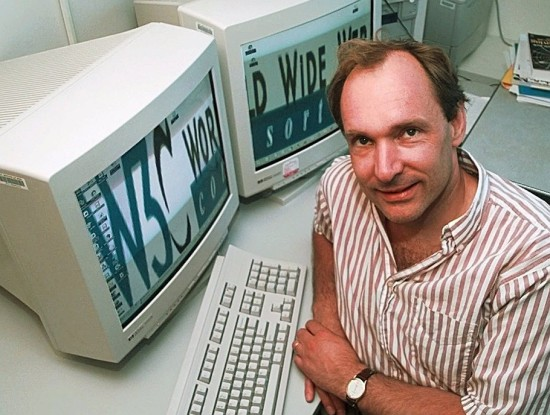

Note:
- Create or the WWW
- Founded the W3C in 1994

---

## 1994 - Netscape Naviguator 
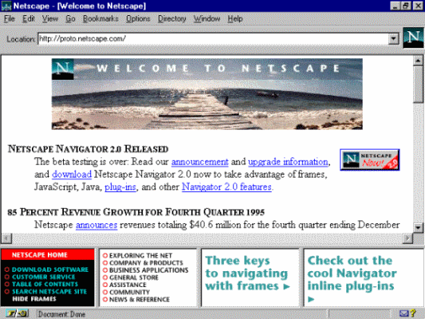

<p class="fragment">Internal Codename: Mosaic Gozilla </p>

Note:
- Jim Clarc, founder of Silicon Graphics, hardware manifacture
- Code name, to kill mosaic (why mozilla firefox)
- Made it more popular very quickly than other browsers
- They managed to kill Mosaic, got around 3/4 of the market share in a very short period of time 
- Rapid expansion but inovating alot
- Added tags that where not part of Time Berners Lee recommandation. I will talk about after
- When Netscape 2. (1995) came out it went public (after only 1 year!), the founder made about 600m$ that day...

---

## The \<blink\> and \<marquee\> tags
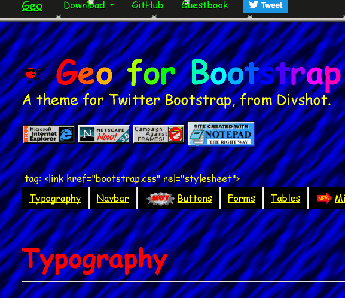
<marquee>BOOM! The marquee tag still works!</marquee>

Note:
<small>
- The era of the `blink` and `marquee` tags for eg. The joys of the 80s.
- Interativity at the time was pretty much limited to these kind of things
- The blink tag was apperently created after a Netscape engineer called Lou Montulli jokes at a bar with co-workers about his previous job working on a text-based linux browser (Lynx). He joked the only "effect" it probably could handle was blinking text. The next day one his co-worker created it. It eventually got ship in the next version of Netscape.
- And Microsoft did not want to be miss the party and created soon after the marquee tag...
</small>

---
## Click...
---
## Wait...


---
## Click...
---
## Wait...


---
We are end 1994

HTML 2.0 only came out early 1996 <!-- .element: class="fragment" -->

It added more tags... <!-- .element: class="fragment" -->

## We need something more! <!-- .element: class="fragment" -->

Note:
- This was the era of HTML 1. Specs for HTML 2 was very slow to come out. Managed by IETF HTML Working Group
- HTML 2 added forms 
- Netscape wanted something  more than just the DOM
- They wanted interactivity in the browser
- We need a scripting language in the Browser
- They wanted more interactivity

---

Apple released HyperCard 2.0 in 1990

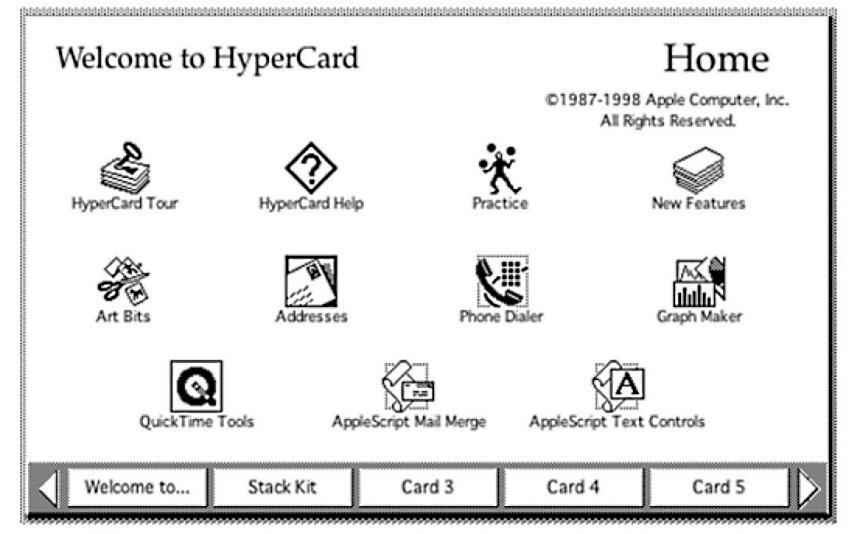]

Note:
- You could attach scripts to buttons and cards
- This is what made Macintosh programming really easy for many applications. 
- Wanted the same for a web-page

>>>

# How it all started
---

### 1995 - Netscape hired Brendan Eich


Note:
- Ask if he could build a scripting language, can you work on this, said yes
- He proposed to do a scripting language based on Scheme. 
- Founders had no idea what it was and said "yes, sure"
- Side note he became the founder of Firefox

---
## Scheme 

<pre>
    <code data-trim data-noescape>
;; Building a list of squares from 0 to 9:
(define (list-of-squares n)
  (let loop ((i n) (res '()))
    (if (< i 0)
        res
        (loop (- i 1) (cons (* i i) res)))))

(list-of-squares 9)
===> (0 1 4 9 16 25 36 49 64 81)
    </code>
</pre>

Note:
- This is what it looks like... Its lisp based
- Enjoy the ()))
- When the founders found out what it was they said... nope...

---
## First version

<p>
    <span style="display: inline-block;" class="fragment fade-right">Java</span>
    <span style="display: inline-block;" class="fragment fade-down"> + Scheme</span>
    <span style="display: inline-block;" class="fragment fade-left"> + Self</span>
</p>
<span class="fragment">|</span>
<p>
    <span style="display: inline-block;" class="fragment">
        <span style="display: inline-block;" class="fragment strike">
            LiveScript
        </span>
    </span>
</p>

<span style="display: inline-block;" class="fragment fade-up">JavaScript!</span>

Note:
- Do something else, Java was the popular thing, make it more like Java!
- Inspired by Java (so inherited from many of the C syntax in JS)
- Still wanted to put some of the good stuff of Scheme and also some of Self, SmallTalk based
- Self is the one that provided the prototype based paradigm (the idea being you cant predict all the objects/class/funciton/props you will need in the future)
- Many languages where already showing that trying to predict everything you need is hard and often leads to heavy refactoring. 
- The prototype approach allowed to ensure evolution was part of the languages DNA
- Netscape wanted to fight against Microsoft (browser wars) so partnered with Sun M. 
- Said they wanted Java in the Browser (could have been once more worse..)
- Dead end, so as a joke they said JavaScript

---

### Java is a trademark of Sun Mircrosystems

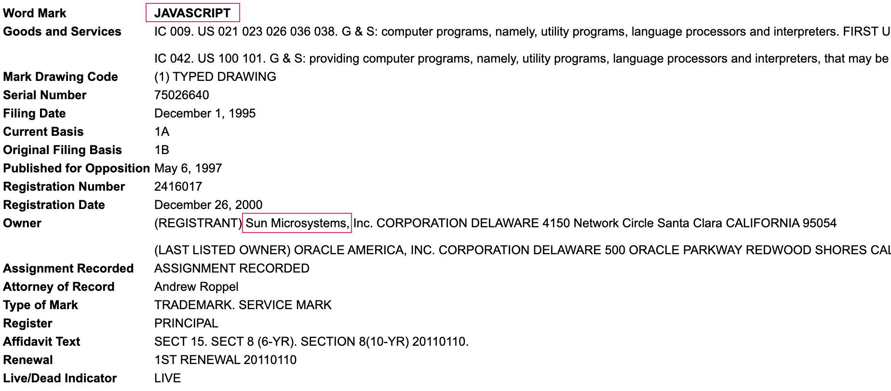

Created confusion for years... <!-- .element: class="fragment" -->

Note:
- Confuson that JavaScript was a sub-set of Java or that they were related in some way. 
- Its more clear today, but not at the time.
- Just about combining forces and marketing

---

<h3>There was a catch... <span class="fragment">It wasn't ready...</span></h3>

---

#### He wrote the language in 10 days only!

JavaScript is not perfect and has issues? <!-- .element: class="fragment" -->

Of course, give JS a break! <!-- .element: class="fragment" -->

 <!-- .element: class="fragment" -->

Got shipped in Netscape 2.0 - Sept 1995 <!-- .element: class="fragment" -->

Note:
- I am sure he had some idea how and design ready 
- But PoC was done in 10 days and very little extra polissh went in the final version
- Most languages would take at years before being launched
---

It was also the first browser to have animated gif!

 <!-- .element: class="fragment" -->

---

Then Microsoft came in the game


JScript <!-- .element: class="fragment" -->

 <!-- .element: class="fragment" -->

Netscape "We need a standard quick!" <!-- .element: class="fragment red" -->

Note:
- Then Microsoft came in the game as NEtscape said they would destroy MS
- Copied the model of netscape (as they did at the time, copy and destroy)
- Reveresed engineered, even the bugs! But not everything worked exactly the same.
- So they created JScript! This lead to compatiblity issues over time and the these wonderfull widgets.
- They needed a standard as worried Microsoft would eat up the market

---
<span class="">
    
</span>

<p>
    <span style="display: inline-block;" class="fragment">
        
    </span>
</p>

<span class="fragment">
    
</span>

Note:
- W3c Was more than happy to tell them to go to hell
- ECMA: European Computer Manufacturers Association
- Long way for a company in California
- Luckily MS would also be part of this commitee 

---

### So what should I call this language?
<p>
    <span style="display: inline-block; fragment">
        <span style="display: inline-block;" class="fragment strike">
            LiveScript
        </span>
    </span>
</p>
<p>
    <span style="display: inline-block;" class="fragment">
        <span style="display: inline-block;" class="fragment strike">
            JavaScript
        </span>
    </span>
</p>
<p>
    <span style="display: inline-block;" class="fragment">
        <span style="display: inline-block;" class="fragment strike">
            JScript
        </span>
    </span>
</p>

ECMAScript! (Officially) <!-- .element: class="fragment" -->

Or more simply ES <!-- .element: class="fragment" -->

But who cares... lets just call it JavaScript... <!-- .element: class="fragment" -->

>>>
# It could have ended here

JavaScript could have died with Netscape (~1999) <!-- .element: class="fragment" -->

<span class="fragment">It survived thanks (?) to Microsoft who ~~copied~~ developed JScript</span>

Note:
- Netscape continued to dominate, but quickly started to struggle against MS with the latest IE5 who became the market leader
- Netscape eventually made the engine open-source and this was the start of Firefox

---

In 2000 started the famous IE5/6 Era

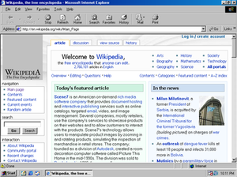

Development of JS essentially stopped here <!-- .element: class="fragment" -->

<span class="fragment">But before MS added the <span class="blue">XMLHttpRequest</span> object...</span>

Note:
- MS did not really believe on that their growth would be linked to the internet at the time
- More focused on Windows and Office

---

It took 5 years (2005) before it's full potential was used

<p class="fragment">
    <sub>Asynchronous JavaScript and XML</sub></br>
    
</p>

 <!-- .element: class="fragment" -->

Ajax and JQuery renwed interest in JavaScript  <!-- .element: class="fragment" -->

Note:
- in 2005 Jesse James Garrett coined the term AJAX
- JQuery became so popular that people would sometime miuxed JS and Jquery
- Not fully understanding they are different things

>>>

# Growing up
2005 - 2015 <!-- .element: class="fragment" -->

---

Its sudden rise to success also meant it quickly became one of the most misunderstood language for years

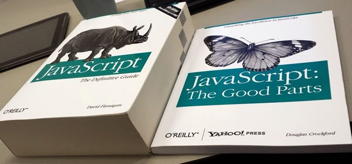 <!-- .element: class="fragment" -->

Note:
- Its sudden growth required made more people use the lamguage
- With more people using, more people misunderstood it
- Very known meme picture of JavaScript. Books written by Douglas Crockford. Highly recommend 

---

### Common misconceptions
<ul>
    <li class="fragment">JavaScript has to many bad parts!
        <small>
            <ul>
                <li class="fragment">Yes... it has/had (var variables...) but mostly removed in ES6!</li>
                <li class="fragment">Also, remember it was first written in 10 days...</li>
            </ul>
        </small>
    </li>
    <li class="fragment">JavaScript is not... Java (Or C++, or Python...)!
        <small>
            <ul>
                <li class="fragment">Confusing name</li>
                <li class="fragment">Often forced to used it because of the Browser</li>
                <li class="fragment">One of the rare languages that can be used by professional and noobs</li>
            </ul>
        </small>
    </li>
    <li class="fragment">JavaScript is slow!
        <small>
            <ul>
                <li class="fragment">True initially, and in part due to the DOM. No longer true today.</li>
                <li class="fragment">When Chrome came out (2008) it added the JIT</li>
                <li class="fragment">
                    
                </li>
            </ul>
        </small>
    </li>
</ul>

---

## Cool kids tried to replace JavaScript! 

<h3 class="fragment">2005 - Adobe tried  Flash</h3>
<h3 class="fragment">2007 - Microsoft tried  Silverlight</h3>
<h3 class="fragment">2011 - Google tried  Dart</h3>

<small class="fragment">They failed... but Dart survived because it transpiled to JS</small>

Transpilation became a trend: <!-- .element: class="fragment" -->

Note:
- Like for teanagers, some cool kid (MS, Adobe, Google) tried to bully JS out of the game
- Adobes attemp was Flash (2005 had good adoption), That had quite some success for some time! but we all know had that ended...
- SilverLight was MS attempt (2007) - Also failed quite miserably 
- Google - (2011) Dart was supposed to be the next gen browser languages, they even made it mative to a special verison of Chrome
- The transpilation method, in the end allowed better browser support and innovation
- If you cant get rid of it, transpile to it.

---

## JS framework fatigue

```
Friend: “How’s it going?”
Me: “Fatigued.”
Friend: “Family?”
Me: “No, Javascript.”
```

Note:
- So many new framework and tools
- The renaissance of JS

---

### The Single Page Application revolution 

New frameworks where coming out all the time <!-- .element: class="fragment" -->

 <!-- .element: class="fragment" -->
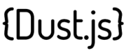 <!-- .element: class="fragment" -->
 <!-- .element: class="fragment" -->
 <!-- .element: class="fragment" -->
 <!-- .element: class="fragment" -->
 <!-- .element: class="fragment" -->
 <!-- .element: class="fragment" -->

And they all needed new tooling...  <!-- .element: class="fragment" -->

Note: 
- Backbone, dust, handlerbars

---

You needed a build tool:

 <!-- .element: class="fragment" -->
 <!-- .element: class="fragment" -->
 <!-- .element: class="fragment" -->
 <!-- .element: class="fragment" -->

You needed a Bundler: <!-- .element: class="fragment" -->

 <!-- .element: class="fragment" -->
 <!-- .element: class="fragment" -->
 <!-- .element: class="fragment" -->

You needed a Script Loader and transpiler: <!-- .element: class="fragment" -->

 <!-- .element: class="fragment" -->
 <!-- .element: class="fragment" -->


Note:
- R = Rollup

---

It became a race

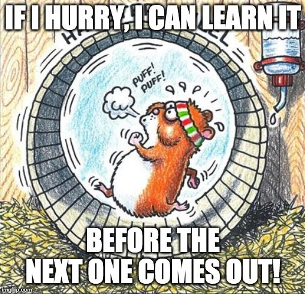

---

But eventually...

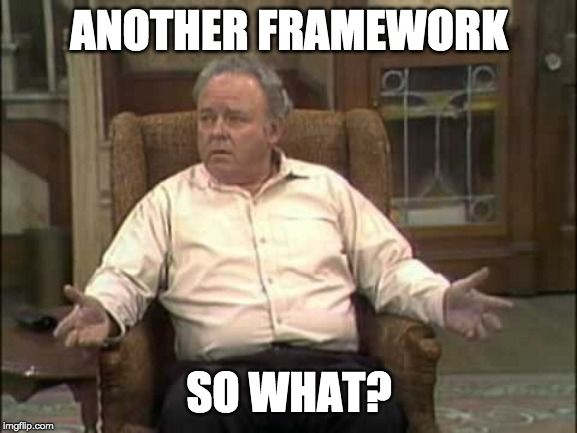

JavaScript was growing up <!-- .element: class="fragment" -->

And eventually stabilized (a bit...)<!-- .element: class="fragment" -->

>>> 

# Where are we now?
2015 - Today <!-- .element: class="fragment" -->

---

## Version history
<small>
<ul>
    <li class="fragment">ES1: 1997 - First Release</li>
    <li class="fragment">ES2: 1998 - Minor changes, ISO standards</li>
    <li class="fragment">ES3: 1999 - Added RegExp, string handling, try/catch, formating</li>
    <li class="fragment"><strike>ES4: 2007</strike> - Abandonned because of disagrerments on the language features</li>
    <li class="fragment">ES5: 2009 - Default/strict mode</li>
    <li class="fragment">ES6: 2015 - (also known as ES2015) added many of the cool stuff!</li>
    <ul>
        <li class="fragment">Naming convention changed to a yearly increment, very confusing...</li>
    </ul>
    <li class="fragment">ES2016 - Exponential operator (**) and Array.prototype.include</li>
    <li class="fragment">ES2017 - async/await using generators</li>
    <li class="fragment">ES2018 - rest/spread operator</li>
    <li class="fragment">ES2019 - Array.prototype.flat, Array.prototype.flatMap, Array.prototype.sort...</li>
</ul>
</small>

Note:
- Micromedia came into play with their ActionScript language that was intended as a superset of JS

---

## Many implementations

| Implementation | Applications         |
|----------------|----------------------|
| V8             | Google Chrome, Node.js, Opera |
| SpiderMonkey   | Firefox, Gecko Layout Engine, Adobe Acrobat |
| Nashorn        | Java                 |
| Nitro          | Webkit, Safari, Qt5  |
| Chakra         | ~~Microsoft Edge~~   |
| JScript 9.0    | Internet Explorer    |

---

Today JavaScript is the most popular language in the world for the last 8 years! (according to StackOverflow)

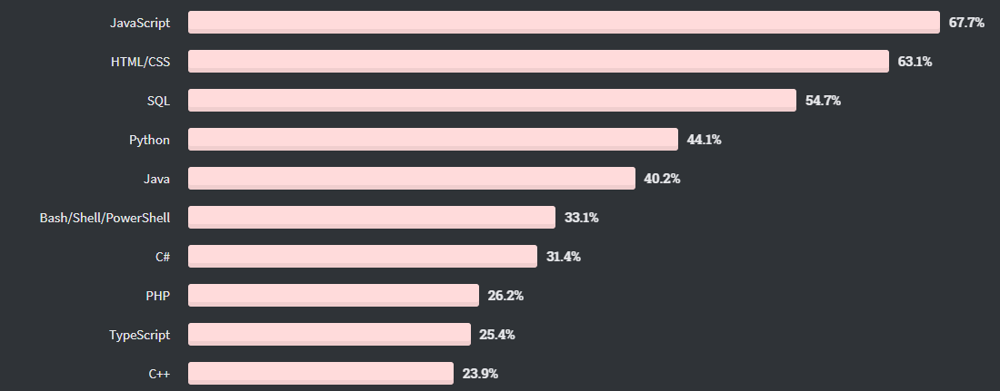

Also the most demanded Language by companies

---

## It has invaded all platforms

Browser - all of them... <!-- .element: class="fragment" -->

Mobile - ReactNative, NativeScript... <!-- .element: class="fragment" -->

Server - NodeJS, Deno <!-- .element: class="fragment" -->

Desktop - Electron  <!-- .element: class="fragment" -->

DataBase - MongoDB, Couchbase <!-- .element: class="fragment" -->

OS - Windows 10 tile apps <!-- .element: class="fragment" -->

TV - <!-- .element: class="fragment" -->

Note:
- Desktop: Spotify, Slack
- TV: Netflix
>>> 

# What lies ahead?
Today and beyond <!-- .element: class="fragment" -->

---

# WebAssembly


Also called WASM

---

### The concept

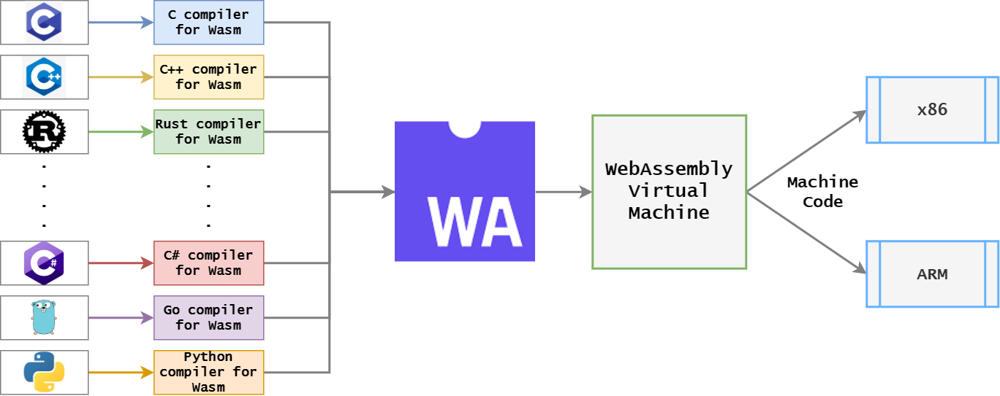

---

### Widely supported today
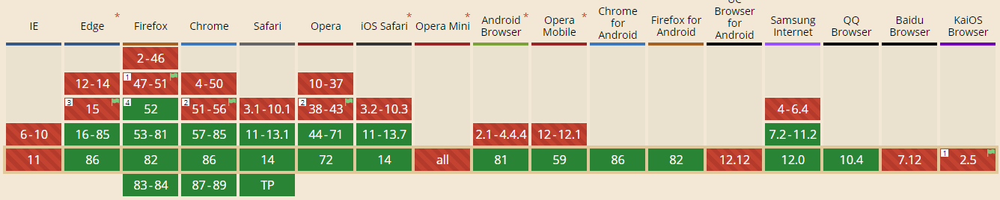

---
## DOOM 3 in the browser!

Dont believe me?    
https://wasm.continuation-labs.com/d3demo/

Re-use existing code and port to the browser!  <!-- .element: class="fragment" -->

---

## The end of the JavaScript monopoly!

Note:
- Still missing a common GC implementation but people are working on it
- Once available, people will be able to code in any language they want for the browser
- Exiting time ahead!

---

## "Always bet on Javascript"
<sub>- Brendan Eich</sub>

Note:
* Many have predicte the end of JavaScript
* Predicted that JS will eventually not be able to reach the demand
* Until now it has always been wrong. 

JS is certainly not the only dominant language or the “best tool” for every situation. 
But increasingly, most tech stacks have it as a central part of their strategy.

>>>

# Thank You!
### Hope you enjoyed

---

# Questions?